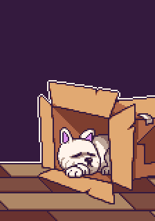

# Hell's Puppy

[Windows Download](https://github.com/VacaRoxa/dogfromhell/releases/download/1.2.0/hellspuppy_windows.zip) | [Linux Download](https://github.com/VacaRoxa/dogfromhell/releases/download/1.2.0/hellspuppy_linux_sdl2.tar.gz) | [Android Google Play link](https://play.google.com/store/apps/details?id=com.vacaroxa.hellspuppy)

It's a game where Satan is imprisoned in a dog and he needs to go back to Hell. 
This is the product of development with an awesome team of people from the 
[VACAROXA](https://apoia.se/vacaroxa). Find them on 
[twitter looking the Hashtag](https://twitter.com/hashtag/vacaroxa?src=hash)
or follow [@estudiovacaroxa](https://twitter.com/estudiovacaroxa).

If you are curious on the Android Studio Project to port it, [you can find it here](https://github.com/ericoporto/vacaroxa_hellspuppy).

Firstly the people involved in the whole project:

[@bakudas](https://twitter.com/bakudas) | [@ricardojuchem](https://twitter.com/ricardojuchem) | [@_Gabrielfer](https://twitter.com/_Gabrielfer) | [@MauricioMunky](https://twitter.com/MauricioMunky) |  [@eri0o](https://twitter.com/eri0o) | Marcel

## Game Controls

Use Arrow left and right keys to move.  **`Alt+Enter`** to fullscreen.

Android has experimental touch controls.

## Gameplay Video

Future Vintage Gaming played the Game so you can [watch below](https://www.youtube.com/watch?v=nCoi0PT_Bk0)!

## Running the game

Go to [Releases](https://github.com/VacaRoxa/dogfromhell/releases) and get latest binaries.

Note Linux binary requires installing sdl2.

## Editing the game

The game is made with [Adventure Game Studio](https://www.adventuregamestudio.co.uk/forums/index.php), so after you `git clone` this repository or
download the `.zip`, you can edit it by loading the `Game.agf` project file on AGS Editor.

